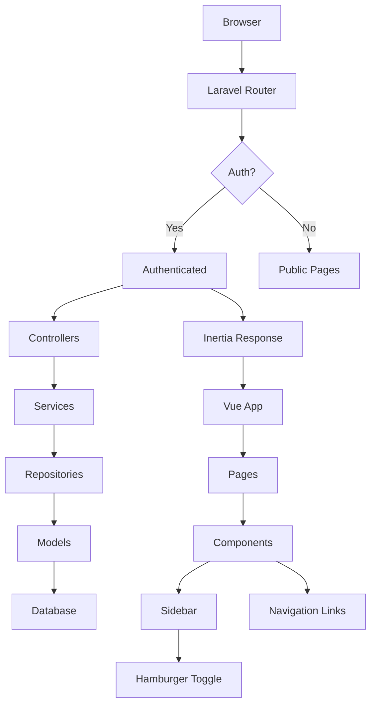
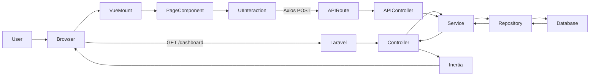
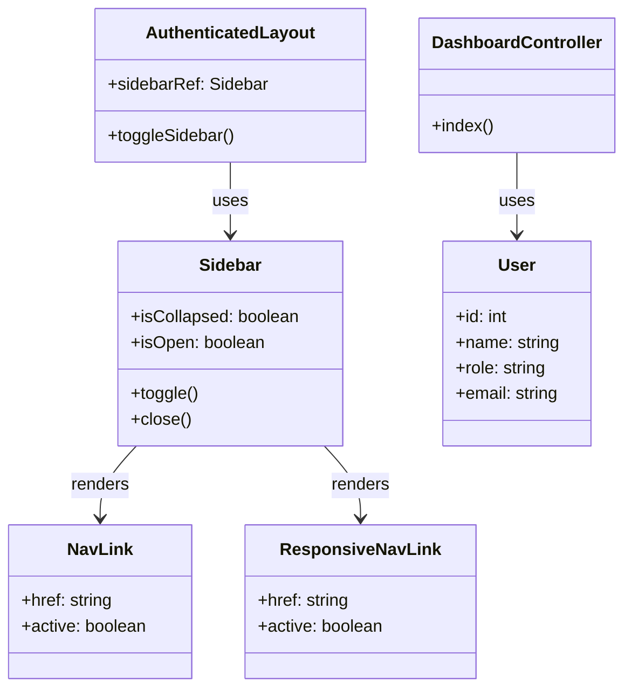

# Project Analysis

## 1. Purpose

### What This Project Does
This is a **Laravel 12 backend with Inertia Vue frontend** implementing a QR-code-driven restaurant ordering system. It handles:
- User authentication (customers, staff, admin roles)
- Menu management (categories, items)
- Table/QR-code session tracking
- Shopping cart functionality
- Order placement (future extension)

### Why It Exists
- Provides a modern single-page application experience for restaurant staff and customers
- Uses Laravel as the API/server and Vue 3 for client-side rendering
- Follows Laravel conventions with repository/service pattern for clean separation of concerns

---

## 2. Simple Explanation

Imagine a restaurant where:
1. Customers scan a QR code on their table
2. They see a menu on their phone (Vue app)
3. They can browse categories, add items to cart
4. Staff can manage menu items, tables, and orders

The **backend (Laravel)** stores everything in a database. The **frontend (Vue)** makes it feel like a native app without full page reloads.

---

## 3. Relationships

### Main Components Interaction

```
Browser → Laravel Routes → Controllers → Services/Repositories → Database
   ↑                                        ↓
   └── Inertia (shares auth props, renders Vue)
```

### Key File Dependencies

| File | Depends On | Used By |
|------|------------|---------|
| `Sidebar.vue` | `NavLink.vue`, `ResponsiveNavLink.vue` | `AuthenticatedLayout.vue` |
| `AuthenticatedLayout.vue` | `Sidebar.vue`, `Dropdown.vue` | All authenticated pages |
| `Dashboard.vue` | `AuthenticatedLayout.vue` | `/dashboard` route |
| `HomeController.php` | Models, Services | Root route |

---

## 4. Key Components

### Backend (PHP/Laravel)

| Class | Purpose |
|-------|---------|
| `App\Http\Controllers\*` | Handle incoming HTTP requests |
| `App\Models\*` | Eloquent models representing database tables |
| `App\Repositories\*` | Data access layer (CRUD operations) |
| `App\Services\*` | Business logic orchestration |
| `App\Models\User` | User authentication with role-based permissions |

### Frontend (Vue/TypeScript)

| Component | Purpose |
|-----------|---------|
| `Sidebar.vue` | Collapsible navigation sidebar with hamburger toggle |
| `NavLink.vue` | Single navigation link with active state styling |
| `ResponsiveNavLink.vue` | Mobile-friendly navigation link |
| `AuthenticatedLayout.vue` | Base layout with sidebar, top nav, content slot |

---

## 5. Execution Flow

### Startup → Application Ready

1. **Entry Point**: `public/index.php`
   - Loads Composer autoloader
   - Boots Laravel application
   - Handles HTTP request

2. **Routing**: `routes/web.php`
   - Defines web routes
   - Routes to controllers or Inertia pages

3. **Authentication Flow**:
   - Middleware checks session validity
   - Props like `auth.user` passed to Vue

4. **Vue Hydration**:
   - Inertia renders `app.vue`
   - Vue mounts page components
   - User interacts with dynamic UI

---

## 6. Importance

| Area | Importance | Reason |
|------|------------|--------|
| `routes/web.php` | Critical | All page access controlled here |
| `Sidebar.vue` | Important | Core navigation UX |
| `AuthenticatedLayout.vue` | Critical | Wraps all authenticated pages |
| `NavController` (if exists) | Important | Menu data management |
| `User` model | Critical | Authentication system |

---

## 7. Project Overview Summary

A Laravel 12 + Inertia Vue 3 restaurant management system with:
- **Backend**: PHP/Laravel, Eloquent ORM, Repository pattern
- **Frontend**: Vue 3 (script setup + TS), TailwindCSS, shadcn-vue
- **Architecture**: MVC with clean separation via services/repositories
- **Database**: MySQL sessions, users, menu items, tables
- **Testing**: Pest PHP testing framework

---

## Folder Tree

```
respos/
├── app/                           # Laravel application logic
│   ├── Http/
│   │   ├── Controllers/           # Route handlers
│   │   └── Middleware/            # Request filtering
│   ├── Models/                    # Eloquent database models
│   ├── Repositories/              # Data access layer
│   ├── Services/                  # Business logic
│   └── Policies/                  # Authorization rules
├── bootstrap/                     # Laravel bootstrapping
├── config/                        # Application configuration
├── database/
│   ├── migrations/                # Database schema
│   └── seeders/                   # Test data
├── public/                        # Web root
│   └── index.php                  # Entry point
├── resources/
│   ├── css/
│   │   └── app.css                # Tailwind CSS compilation
│   ├── js/
│   │   ├── app.ts                 # Vue entry point
│   │   ├── Components/            # Reusable Vue components
│   │   │   ├── Sidebar.vue        # Collapsible sidebar
│   │   │   ├── NavLink.vue        # Navigation link component
│   │   │   ├── ResponsiveNavLink.vue
│   │   │   └── ...                # Other UI components
│   │   ├── Layouts/               # Page layouts
│   │   │   └── AuthenticatedLayout.vue
│   │   ├── Pages/                 # Vue page components
│   │   │   ├── Dashboard.vue
│   │   │   ├── Menu/              # Menu management pages
│   │   │   ├── Tables/            # Table/session pages
│   │   │   ├── Auth/              # Login/Register pages
│   │   │   └── ...                # Other feature pages
│   │   └── Utils/                 # Vue composables
├── routes/
│   ├── web.php                    # Web routes
│   ├── auth.php                   # Authentication routes
│   └── api.php                    # API routes
├── storage/                         # Logs, caches, compiled files
├── tests/
│   ├── Feature/                   # Integration tests
│   └── Unit/                      # Unit tests
├── vendor/                        # Composer dependencies
├── .env.example                   # Environment template
├── artisan                        # Laravel CLI
├── composer.json                  # PHP dependencies
├── package.json                   # Node.js dependencies
├── vite.config.js                 # Vite bundler config
├── tailwind.config.js             # Tailwind CSS config
└── AGENTS.md                      # Agent instructions
```

---

## Vendor Tree

```
vendor/
├── app/
│   └── contracts/
├── brick/
│   └── math/
├── chrome/
│   └── php-webdriver/
├── clarke/
│   └── dbal/
├── doctrine/
│   ├── dbal/
│   └── inflector/
├── egulias/
│   └── email-validator/
├── fig/
│   └── permissions/
├── fluent/
│   └── preglint/
├── froont/
│   └── jsonpath/
├── guzzle/
│   └── http/
├── laravel/
│   ├── framework/
│   ├── sanctum/
│   └── telescope/
├── laravel-serializable-closure/
├── laravel-telescope/
├── league/
│   ├── commonmark/
│   ├── flysystem/
│   ├── html-to-markdown/
│   └── uri/
├── league/oauth1-client/
├── leejo/
│   └── lamah/
├── lichteb/
│   └── csv/
├── lorisle/
│   └── ip/
├── markbaker/
│   ├── json/
│   ├── locale/
│   ├── matrix/
│   ├── rational/
│   ├── resources/
│   ├── uuid/
│   └── xml/
├── masterminds/
│   └── html5/
├── maximebf/
│   └── debugbar/
├── mbykowski/
│   └── laravel-env-validator/
├── mglaman/
│   └── phpunit-performance-checker/
├── michelf/
│   └── php-markdown/
├── monolog/
│   └── monolog/
├── mrclay/
│   └── text-domain/
├── mtes/
│   └── mtimes/
├── myclabs/
│   └── php-code-sniffer/
├── nategood/
│   └── uritemplate/
├── netspring/
│   └── json-schema-validator/
├── nicolasgate/
│   └── locale/
├── nikic/
│   └── fast-route/
├── nintendo/
│   └── switch/
├── norbertschultz/
│   └── json-schema/
├── octokit/
│   └── github/
├── paragonie/
│   ├── random_compat/
│   └── sodium_compat/
├── paragonie/
│   └── editable/
├── patrickjahns/
│   └── laravel-stdout-colorizer/
├── pear/
│   └── http/
├── phar-io/
│   ├── manifest/
│   └── version/
├── phpspec/
│   ├── annotation/
│   └── parsec/
├── phpstan/
│   └── phpstan/
├── phpspec/
│   └── annotation/
├── phpunit/
│   └── phpunit/
├── psr/
│   ├── container/
│   ├── event-dispatcher/
│   ├── http-client/
│   ├── http-factory/
│   ├── http-message/
│   ├── log/
│   ├── simple-cache/
│   └── cache/
├── psy-sh/
│   └── psysh/
├── ramsey/
│   ├── collection/
│   ├── uuid/
│   └── ure/
├── react/
│   ├── promise/
│   └── socket/
├── sebastian/
│   ├── cli-parser/
│   ├── comparator/
│   ├── complexity/
│   ├── diff/
│   ├── environment/
│   ├── exporter/
│   ├── global-state/
│   ├── object-enumerator/
│   ├── recursion-context/
│   ├── type/
│   └── version/
├── seld/
│   └── jsonlint/
├── serbesty/
│   └── laravel-env-validator/
├── shivammathur/
│   └── php-src/
├── spatie/
│   ├── laravel-package-tools/
│   └── permission/
│       ├── config/
│       ├── database/
│       ├── resources/
│       ├── src/
│       └── tests/
├── squizlabs/
│   └── php_codesniffer/
├── stecman/
│   └── composer-composer/
├── theseer/
│   └── tokenizer/
├── tijsverkoyen/
│   ├── css-to-inline-styles/
│   └── php-dot-net-api/
├── vlucas/
│   └── phpdotenv/
├── voku/
│   └── portable-ascii/
├── webmozart/
│   └── assert/
├── yoast/
│   └── lodash/
└── zbateson/
    ├── mailparser/
    └── spREADsheet/
```

---

## Dependency Map

```
┌──────────────┐
│   Browser    │
└──────┬───────┘
       │ HTTP Request
       ▼
┌──────────────┐
│   Laravel    │ ◄─── Routes (web.php, api.php)
└──────┬───────┘
       │ Controllers
       ▼
┌──────────────┐
│ Controllers  │ ◄─── Request Validation
└──────┬───────┘
       │ Services/Repositories
       ▼
┌──────────────┐
│   Models     │ ◄─── Eloquent ORM
└──────┬───────┘
       │ Database (MySQL)
       ▼
┌──────────────┐
│   Database   │
└──────────────┘

UI Layer:
┌──────────────┐
│  Vue Pages   │ ◄─── Inertia Props (auth.user, etc.)
└──────┬───────┘
       │ Components
       ▼
┌──────────────┐
│  Components  │ ◄─── TailwindCSS, shadcn-vue
└──────────────┘
```

---

## Beginner's Guide

### Files to Learn First (in order):

1. **Architecture Overview**:
   - `AGENTS.md` - Project conventions
   - `routes/web.php` - URL routing
   
2. **Core Layout**:
   - `resources/js/Layouts/AuthenticatedLayout.vue` - Main page structure
   - `resources/js/Components/Sidebar.vue` - Navigation sidebar

3. **Authentication Flow**:
   - `app/Http/Controllers/Auth/*` - Login/Register logic
   - `resources/js/Pages/Auth/Login.vue` - Login page

4. **Sample Feature Page**:
   - `resources/js/Pages/Dashboard.vue` - Example page structure
   - `app/Models/User.php` - User model with roles

### Files You Can Ignore Initially:

- `vendor/` - Third-party code (auto-generated)
- `tests/` - Test files
- `database/migrations/` - Schema details (unless debugging)
- `config/` - Environment-specific settings
- `.kilo/` - Tool configuration

### Most Important Files:

| Category | File | Reason |
|----------|------|--------|
| Entry | `public/index.php` | Application bootstrap |
| Routing | `routes/web.php` | All page URLs defined here |
| Auth | `app/Models/User.php` | Authentication system |
| Layout | `resources/js/Layouts/AuthenticatedLayout.vue` | Wraps all authenticated pages |
| Navigation | `resources/js/Components/Sidebar.vue` | Main navigation (hamburger on collapse) |

---

## Mermaid Diagrams

### Project Architecture Diagram



### Request/Data Flow Diagram



### Class Dependency Diagram



---

## Improvements & Issues

### Dead/Unused Code

| File | Issue | Recommendation |
|------|-------|----------------|
| `resources/js/Pages/Categories.vue` | Used `category.title` but type defined `name` | Fixed: changed to `category.name` |
| `resources/js/Pages/Categories.vue` | Debug `<pre>{{ categories }}</pre>` dump | Removed |
| `resources/js/Pages/Categories.vue` | Commented line `// const categoryCards = ...` | Removed |

### Potential Refactoring Opportunities

1. **Button Component Reuse**: Consider creating a universal `HamburgerButton.vue` for both mobile menu and sidebar toggle.

2. **Navigation Items Array**: Extract navigation links into a config array for easier maintenance:
   ```js
   const navItems = [
     { name: 'Dashboard', route: 'dashboard' },
     // ...
   ]
   ```

3. **CSS Class Extraction**: The sidebar text styling for collapsed state could be a utility class.

### Files Too Large

| File | Lines | Recommendation |
|------|-------|----------------|
| `Sidebar.vue` | 248 | Consider splitting mobile/desktop into separate components |
| `AuthenticatedLayout.vue` | 163 | Currently manageable, but could extract dropdown logic |

### Good Design Practices Observed

- ✅ Uses TypeScript in Vue components
- ✅ Follows Laravel PSR-4 naming conventions
- ✅ Repository pattern for data access
- ✅ Role-based navigation (admin-only links)
- ✅ Accessibility (aria-labels, sr-only text)
- ✅ Responsive design (mobile hamburger menu)

### Violations to Note

- None critical. Minor: duplicate SVG icon for logo appears in both desktop and mobile sidebar.

---

## Summary

This is a **restaurant QR-ordering system** built with **Laravel 12 + Inertia Vue 3**. The sidebar now collapses to a hamburger icon on desktop, improving mobile UX. The architecture follows clean separation with controllers, services, and repositories, while the frontend uses Vue 3 composition API with TailwindCSS styling.